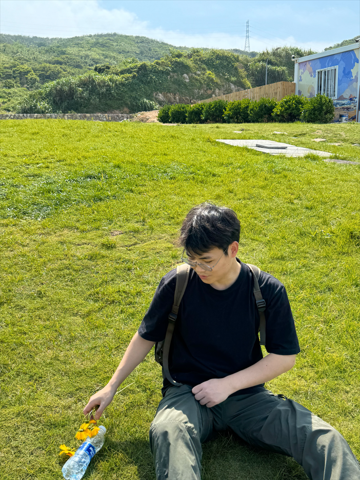

# Introduction
Hi! I'm WU YILIN also can call me Levi , a student in the Framework-Based Software Design and Development course. I am truly excited about this course as I expect to learn a lot about modern software maintenance practices and how to work with legacy systems. In today's rapidly evolving technological landscape, the ability to maintain and update software efficiently is crucial. I believe that understanding modern maintenance techniques will not only enhance my technical skills but also enable me to contribute effectively to software development projects.
Moreover, working with legacy systems presents a unique set of challenges and opportunities. These systems often contain valuable business logic and data, but they may also be outdated and difficult to maintain. By learning how to work with legacy systems, I hope to gain the skills and knowledge necessary to modernize and improve these systems, while also preserving their essential functionality.
I am looking forward to engaging with the course materials, participating in discussions with my fellow students, and working on hands-on projects that will allow me to apply what I have learned. I am confident that this course will provide me with a solid foundation in software design and development, and I am eager to use this knowledge to pursue a career in the field.
In addition to my academic goals, I am also interested in exploring the ethical and social implications of software development. As software becomes increasingly integrated into our daily lives, it is important to consider the impact that it has on individuals and society as a whole. I hope to have the opportunity to discuss these issues in the context of the course, and to learn how I can use my skills and knowledge to develop software that is not only technically sound but also socially responsible.
Overall, I am very excited about the Framework-Based Software Design and Development course, and I am looking forward to a challenging and rewarding learning experience. I am confident that this course will provide me with the skills and knowledge necessary to succeed in the field of software development, and I am eager to get started!

  <!-- Link to the uploaded image -->

## GitHub Profile

You can view my personalized GitHub profile https://github.com/WU-YILIN

